# Laboratorio de Java

## 1. Verificación de la versión de Java
Vemos la versión de Java instalada en el sistema:

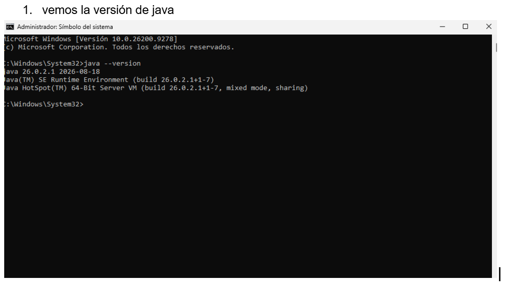

## 2. Configuración de variables de entorno
Compilamos y verificamos el entorno de ejecución:

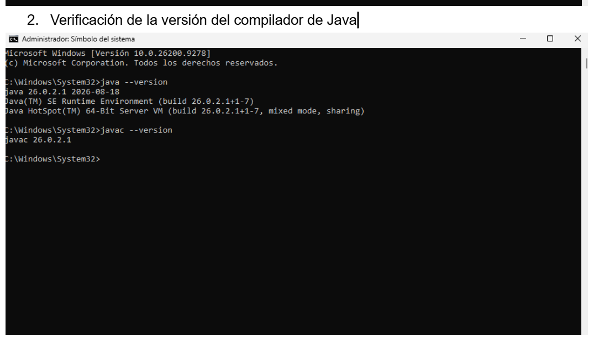

## 3. Tercer Paso del Laboratorio
Descripción del tercer procedimiento:

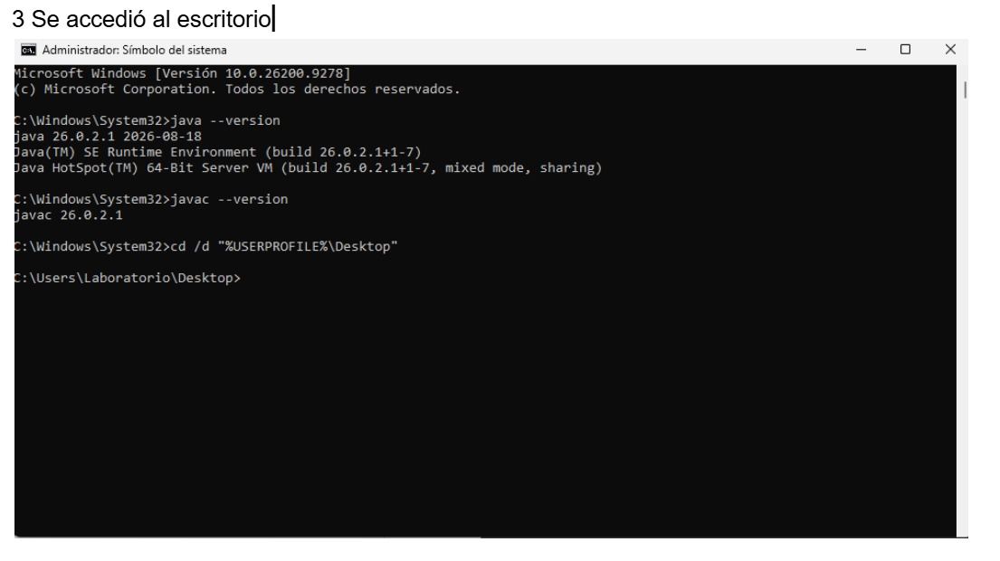

## 4. Cuarto Paso del Laboratorio
Descripción del cuarto procedimiento:

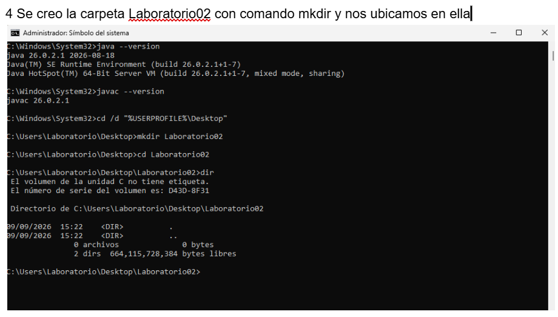

## 5. Quinto Paso del Laboratorio
Descripción del quinto procedimiento:

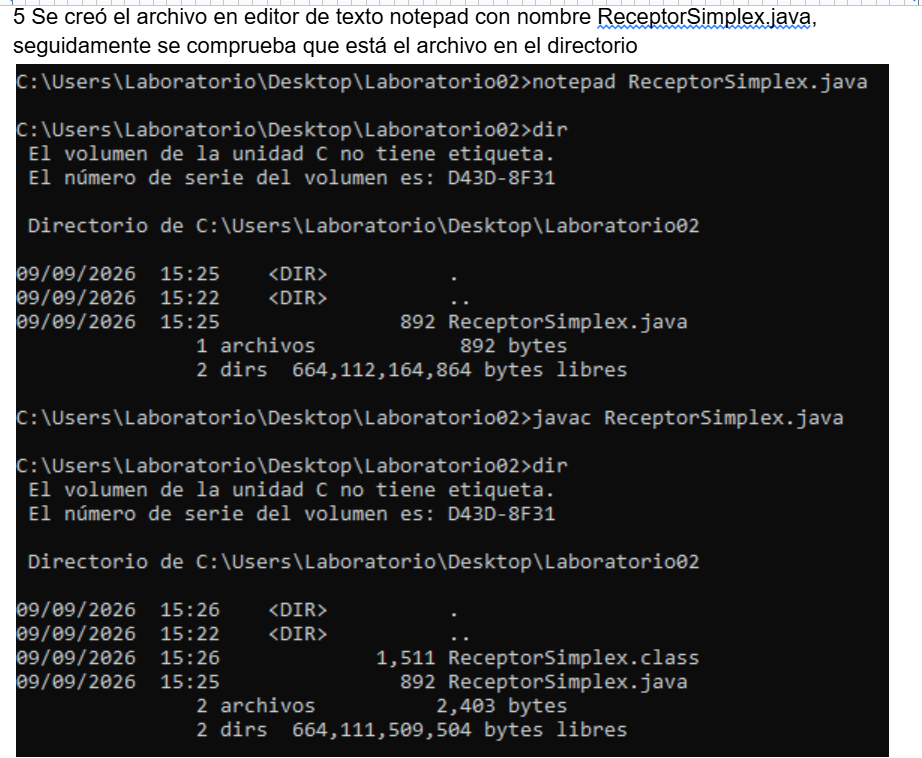

## 6. Sexto Paso del Laboratorio
Descripción del sexto procedimiento:

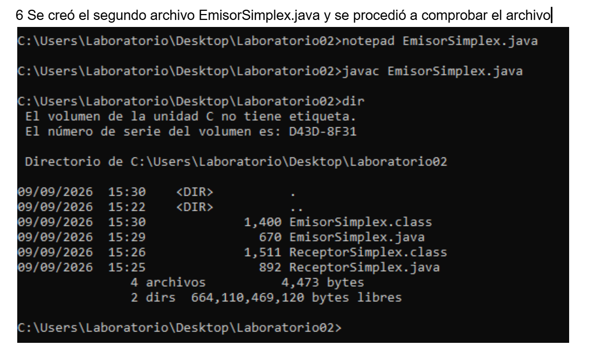

## 7. Séptimo Paso del Laboratorio
Descripción del séptimo procedimiento:

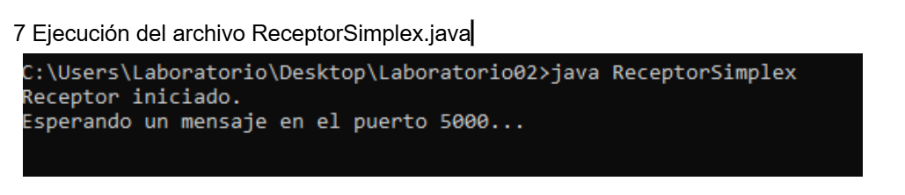

## 8. Octavo Paso del Laboratorio
Descripción del octavo procedimiento:

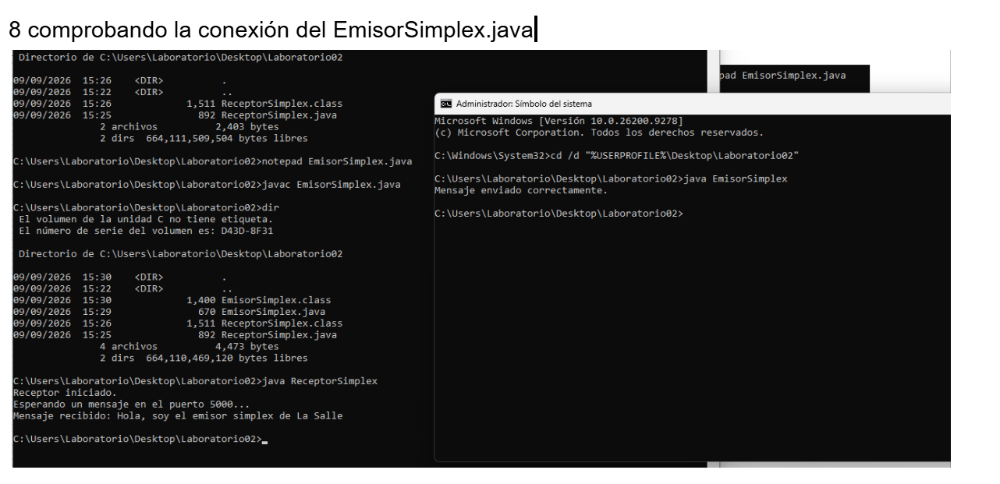

## 9. Noveno Paso del Laboratorio
Descripción del noveno procedimiento:

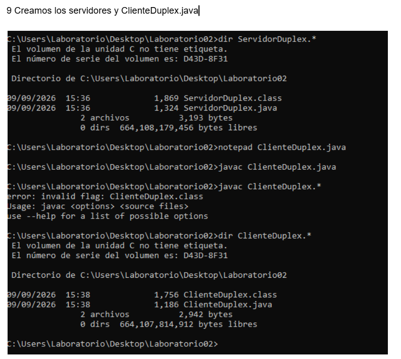

## 10. Décimo Paso del Laboratorio
Descripción del décimo procedimiento:

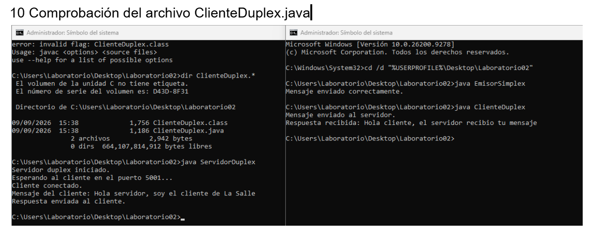

## 11. Undécimo Paso del Laboratorio
Descripción del undécimo procedimiento:

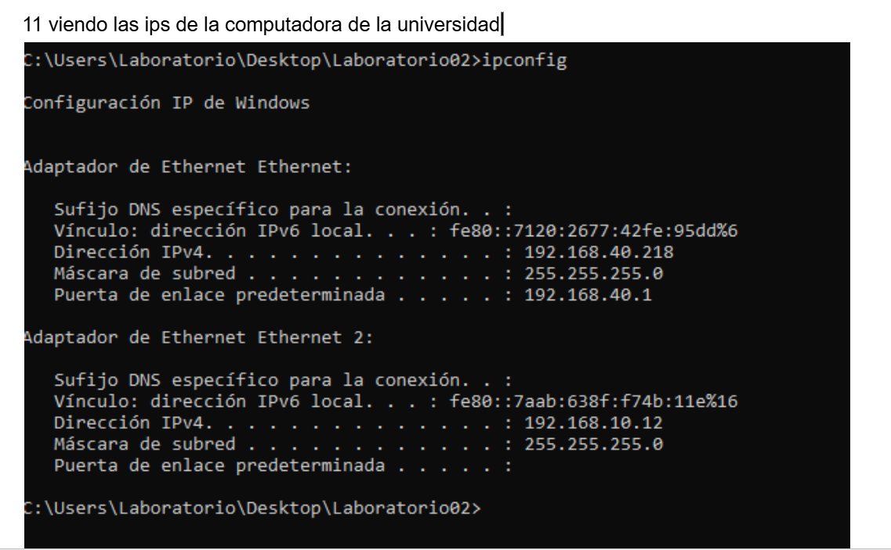

## 12. Duodécimo Paso del Laboratorio
Descripción del duodécimo procedimiento del laboratorio:

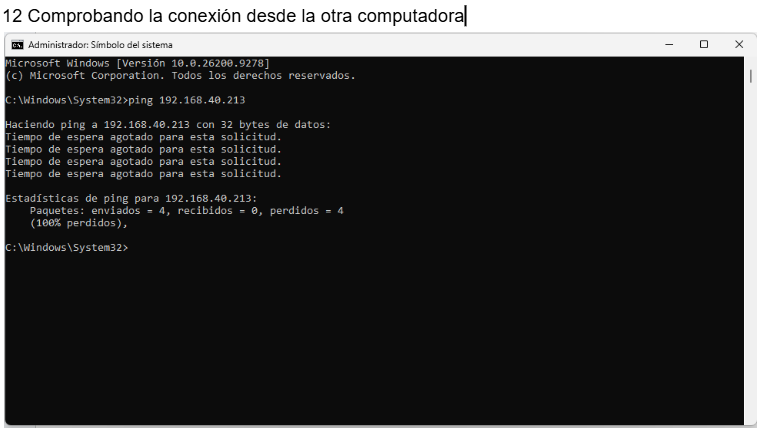

## 13. Trigésimo Paso del Laboratorio
Descripción del último procedimiento del laboratorio:

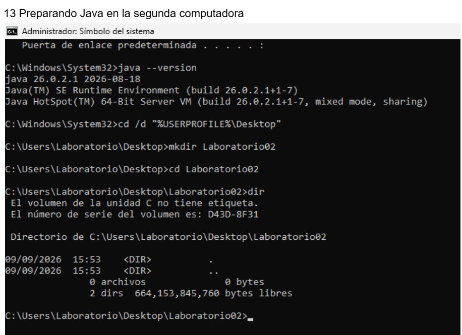

## 14. Cuadragésimo Paso del Laboratorio
Descripción del Cuadragésimo procedimiento del laboratorio:

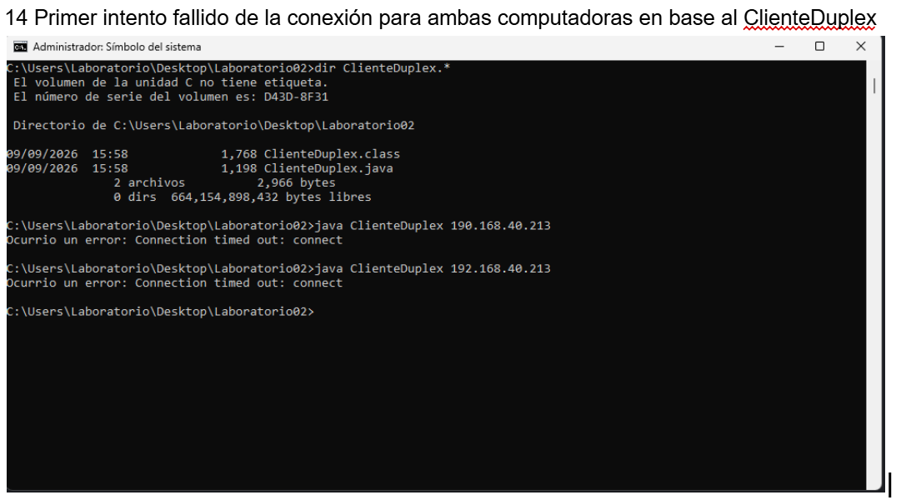

## 15. Quincuagésimo Paso del Laboratorio
Descripción del quincuagésimo procedimiento del laboratorio:

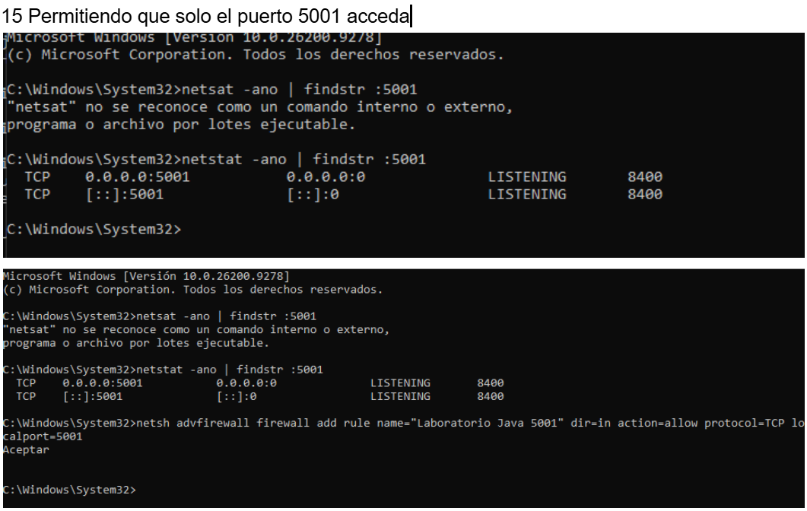

## 16. Sexagésimo Paso del Laboratorio
Descripción del Sexagésimo procedimiento del laboratorio:

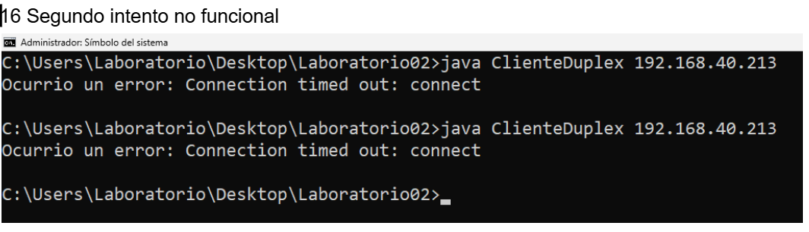

