# Laboratorio 04 – Comunicación simplex, dúplex y orientada a conexión

## Integrantes

| Alumno | Tarea realizada | Porcentaje |
|---|---|---|
| Ampuero Gonzales, Luis Fernando | Configuración de Docker y contenedores | 100% |
| Chipana Benavente, Brayan Gabriel | Captura y análisis simplex y dúplex | 100% |
| Macedo Torres, Marco Gabriel | Captura y análisis TCP en Wireshark | 100% |
| Solórzano Vilca, Favio Andre | Redacción y estructuración del informe | 100% |

---

## 1. Objetivo

Comprobar en la práctica tres tipos de comunicación entre procesos que corren en contenedores distintos, y observar en Wireshark cómo se ve cada una en la red:

- **Simplex:** los datos viajan en un solo sentido.
- **Dúplex:** los datos viajan en ambos sentidos.
- **Orientada a conexión:** se establece una conexión antes de enviar los datos (TCP).

---

## 2. Entorno utilizado

Se trabajó en Windows con **Docker Desktop (opción C de la guía)**. Se levantaron tres contenedores basados en `eclipse-temurin:17-jdk` conectados a la red `rcd_lab04_network_escobedo`. Las pruebas se hicieron entre `container1` y `container2`. El `container3` quedó levantado pero no se usó.

Como Wireshark de Windows no ve la red interna de Docker, la captura de paquetes se hizo con `tcpdump` dentro de `container2`. Cada captura se guardó en un archivo `.pcap` y luego se abrió en Wireshark para analizarla.

### 2.1 Clonación del repositorio

Se clonó el repositorio con `git clone https://github.com/rescobedoulasalle/rcd.git`. La salida confirma la descarga completa de los objetos y la verificación del directorio de trabajo mediante `dir`:

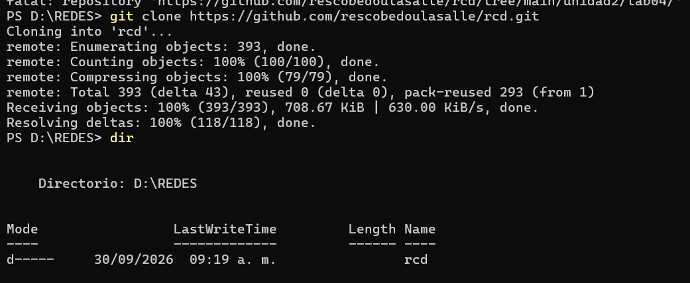

A continuación, se navegó a la carpeta de trabajo `unidad2\lab04`, comprobando la existencia de los archivos base del laboratorio (`docker-compose.yml`, `Dockerfile`, `Ejemplo1Emisor.java`, `Ejemplo1Receptor.java`, entre otros):

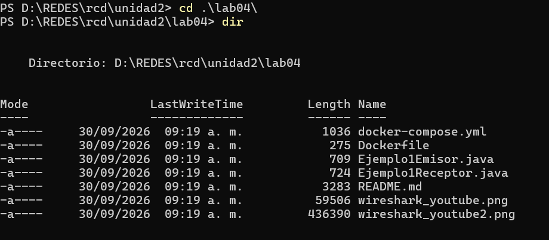

### 2.2 Levantar los contenedores

Se ejecutó `docker compose up -d --build`. Docker descargó la imagen base de Java 17 (`eclipse-temurin:17-jdk`) y construyó la imagen personalizada en aproximadamente 36 segundos:

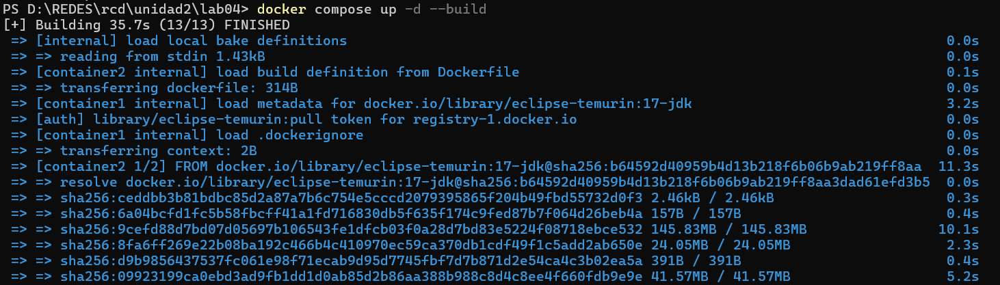

Al finalizar la construcción, el entorno creó la red `rcd_lab04_network_escobedo` e inició los tres contenedores (`container1`, `container2` y `container3`) reportando el estado *Started*:

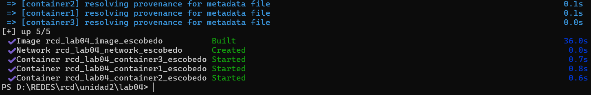

Mediante el comando `docker ps` se verificó la ejecución activa de los tres contenedores en estado *Up*:

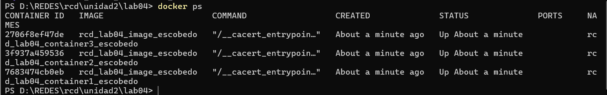

### 2.3 Copiar y compilar el código

Se creó la carpeta `/root/lab` dentro de `container1` y `container2` para copiar los archivos con `docker cp`. Se incluyeron los programas base y los cuatro desarrollados para este laboratorio:

- `Ejemplo2DuplexServidor.java` y `Ejemplo2DuplexCliente.java` (UDP bidireccional).
- `Ejemplo3TCPServidor.java` y `Ejemplo3TCPCliente.java` (TCP con conexión).

Posteriormente, se ejecutó `javac *.java` dentro de los contenedores y se corroboró la creación de los seis archivos `.class`:

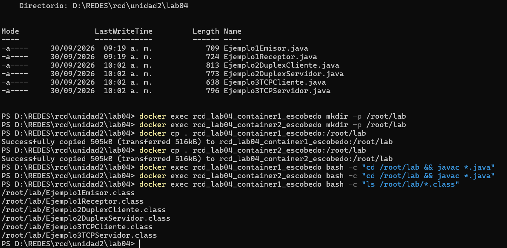

### 2.4 Direcciones IP

Con el comando `hostname -i` ejecutado en cada contenedor se obtuvieron las direcciones IP asignadas dinámicamente por la red de Docker:

| Contenedor | Rol | Dirección IP |
|---|---|---|
| `container1` | Emisor / Cliente | `172.18.0.4` |
| `container2` | Receptor / Servidor | `172.18.0.2` |

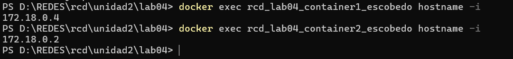
---

## 3. Comunicación simplex (UDP)

En la comunicación simplex la transmisión de datos ocurre en un único sentido. Se utilizaron los programas `Ejemplo1Receptor` en `container2` (puerto `5000`) y `Ejemplo1Emisor` en `container1`.

**Pasos realizados**

1. Se inició la captura en segundo plano guardando el tráfico en `/root/lab/simplex.pcap`.
2. Se ejecutó el receptor a la escucha en el puerto `5000`.
3. Desde `container1` se envió el mensaje `Hola simplex` hacia la IP `172.18.0.2`.

En la terminal dividida se observa la ejecución simultánea de los comandos en ambos contenedores:

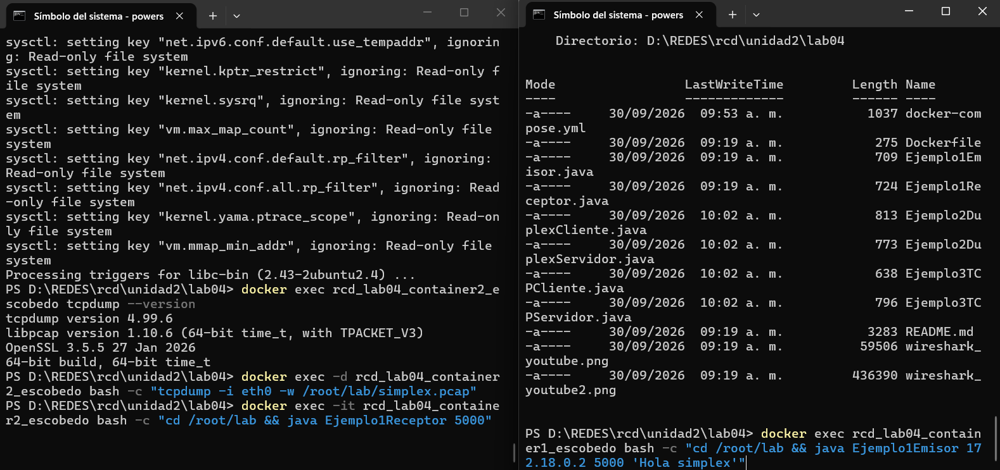
Una vez finalizado el envío del mensaje, se detuvo el proceso de `tcpdump` con `pkill` y se extrajo el archivo `simplex.pcap` hacia la máquina física en Windows para su revisión:

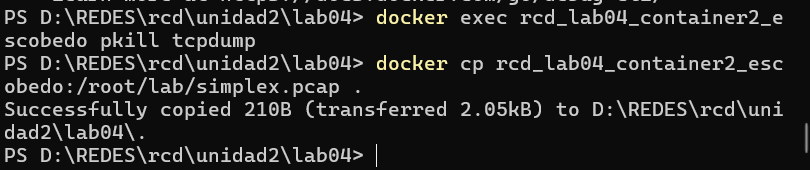
**Análisis en Wireshark**

Al abrir `simplex.pcap` sin filtros se visualizan tres paquetes en total:

1. **ARP (request):** `container1` consulta por broadcast quién posee la IP `172.18.0.2`.
2. **ARP (reply):** `container2` responde indicando su dirección MAC física.
3. **UDP:** Datagrama desde `172.18.0.4` (puerto `38298`) hacia `172.18.0.2` (puerto `5000`), con una carga útil de `Len=12` (correspondiente a los 12 caracteres del texto `Hola simplex`).

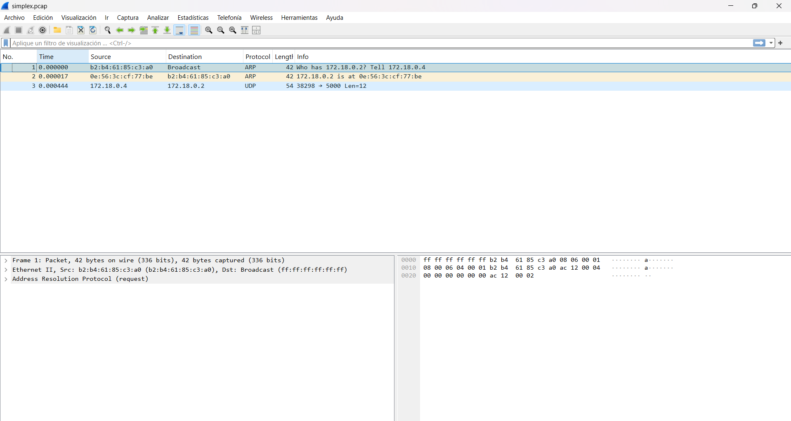
Aplicando el filtro `udp.port == 5000` se aísla de manera limpia la transmisión del protocolo de transporte:

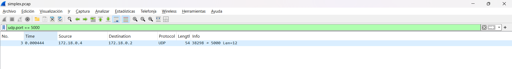
**Conclusión:** Se verifica la presencia de un único datagrama de datos del emisor al receptor sin acuse de recibo ni paquete de respuesta, confirmando la naturaleza **simplex** del esquema.

---

## 4. Comunicación dúplex (UDP)

En la comunicación dúplex ambos extremos intercambian mensajes. El servidor `Ejemplo2DuplexServidor` (puerto `5001`) procesa la solicitud entrante y responde de manera automática al origen. El cliente `Ejemplo2DuplexCliente` envía el mensaje y se queda esperando el retorno.

Antes de la transmisión, se inició la captura en `duplex.pcap` y se dejaron preparados los procesos en ambas terminales:

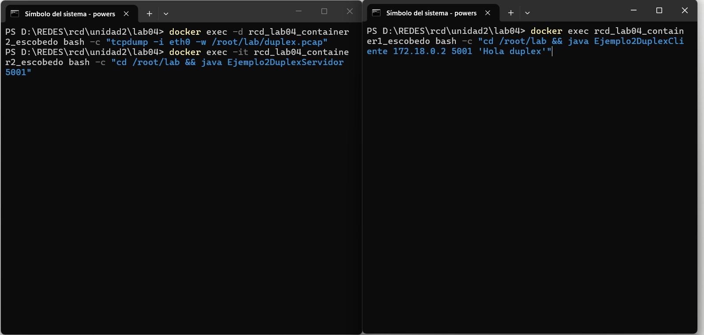
**Resultado en las terminales**

Tras la ejecución del cliente, ambas consolas despliegan la recepción de sus respectivos mensajes:

- **Servidor (`container2`):** `Servidor recibio: Hola duplex`
- **Cliente (`container1`):** `Cliente recibio: Respuesta a: Hola duplex`

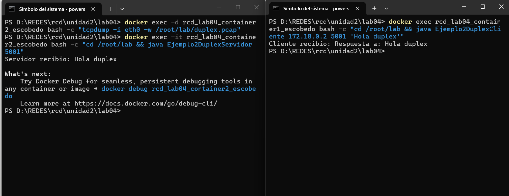
**Análisis en Wireshark** (filtro `udp.port == 5001`)

La captura confirma la secuencia bidireccional mediante dos paquetes independientes:

| Paquete | Origen → Destino | Puertos | Carga útil (Payload) |
|---|---|---|---|
| 1 | `172.18.0.4` → `172.18.0.2` | `38380` → `5001` | 11 bytes (`Hola duplex`) |
| 2 | `172.18.0.2` → `172.18.0.4` | `5001` → `38380` | 24 bytes (`Respuesta a: Hola duplex`) |

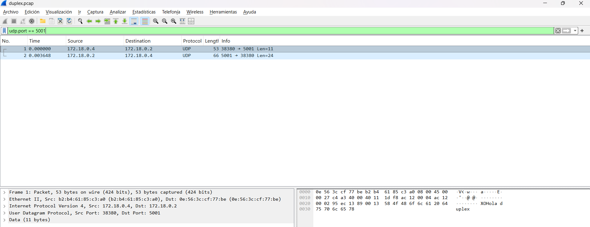
**Conclusión:** Existen dos paquetes (ida y vuelta). A pesar de viajar en ambos sentidos (dúplex), al emplear UDP no existe un protocolo de enlace previo ni señalizaciones de control.

---

## 5. Comunicación orientada a conexión (TCP)

Para el esquema orientado a conexión se utilizaron `Ejemplo3TCPServidor` (puerto `5002`) y `Ejemplo3TCPCliente`. A diferencia de UDP, TCP exige establecer una sesión válida antes de transferir datos de aplicación.

En la primera fase, el servidor pasa a estado de escucha mostrando el mensaje `Esperando conexion...` mientras la captura `tcp.pcap` permanece activa:

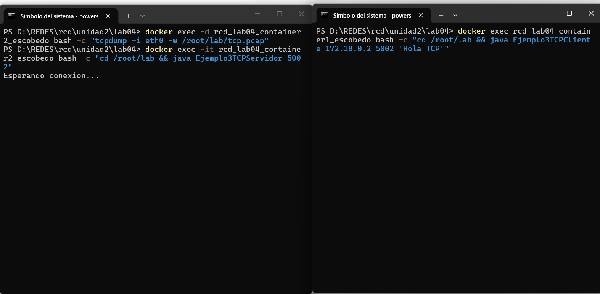
**Resultado en las terminales**

Una vez efectuada la conexión y el intercambio, los registros confirman la entrega garantizada:

- **Servidor (`container2`):** `Servidor recibio: Hola TCP`
- **Cliente (`container1`):** `Cliente recibio: Respuesta TCP a: Hola TCP`

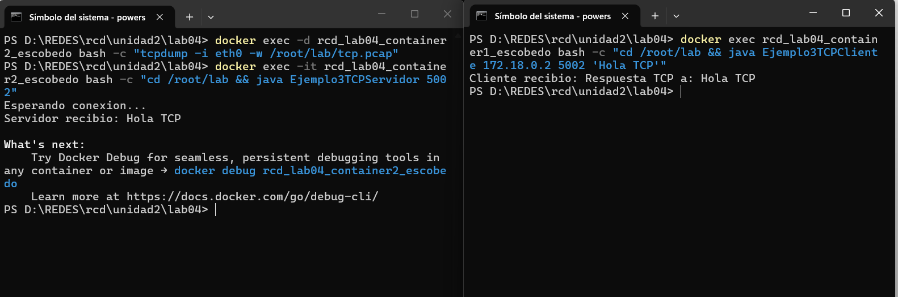
**Análisis en Wireshark** (filtro `tcp.port == 5002`)

La captura expone un total de 10 paquetes que detallan el ciclo de vida completo del socket TCP:

| Fase del Protocolo | Paquetes | Descripción Técnica |
|---|---|---|
| **Establecimiento (Saludo de tres vías / Handshake)** | 1 `[SYN]`, 2 `[SYN, ACK]`, 3 `[ACK]` | Petición de conexión del cliente, respuesta con aceptación del servidor y confirmación final. |
| **Transmisión de Datos** | 4 `[PSH, ACK]` (Len=9), 5 `[ACK]` | Envío de `Hola TCP` (8 caracteres + `\n`) con empuje inmediato (`PSH`) y confirmación (`ACK`). |
| **Respuesta del Servidor** | 6 `[PSH, ACK]` (Len=26), 7 `[ACK]` | Retorno de `Respuesta TCP a: Hola TCP` y su respectivo `ACK` de recepción por el cliente. |
| **Cierre de Conexión (Desconexión de cuatro vías)** | 8 `[FIN, ACK]`, 9 `[FIN, ACK]`, 10 `[ACK]` | Cierre ordenado de los sockets en ambos sentidos finalizando la sesión. |

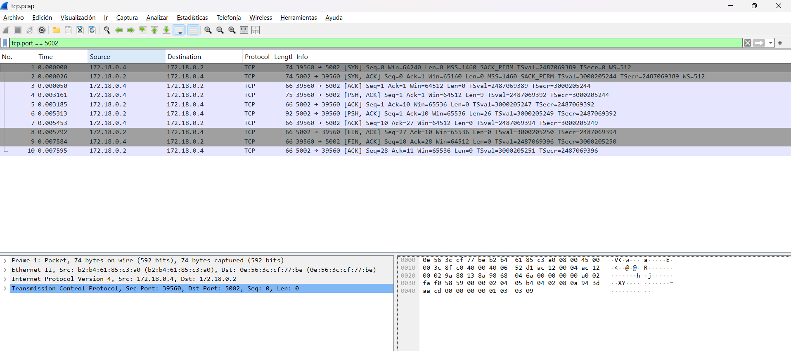
**Conclusión:** TCP garantiza la confiabilidad en la entrega mediante el saludo de tres vías, el control de flujo y el cierre formal. Esto incrementa la sobrecarga en la red (10 paquetes TCP frente a los 2 de UDP dúplex).

---

## 6. Comparación de esquemas

| Criterio | Simplex (UDP) | Dúplex (UDP) | Orientada a Conexión (TCP) |
|---|---|---|---|
| **Total paquetes (sin ARP)** | 1 | 2 | 10 |
| **Flujo de datos** | Unidireccional | Bidireccional | Bidireccional |
| **Fase de negociación** | No requiere | No requiere | Sí (`SYN` → `SYN-ACK` → `ACK`) |
| **Confirmación de entrega** | No (`Best-effort`) | No (`Best-effort`) | Sí (`ACK` por segmento) |
| **Finalización de sesión** | N/A | N/A | Sí (`FIN` / `ACK`) |

---

## 7. Conclusiones

- **Diferencia de sobrecarga (Overhead):** UDP no requiere negociación previa ni manejo de estado. En simplex requiere solo 1 datagrama y en dúplex 2 datagramas independientes. TCP requiere 10 paquetes para realizar exactamente el mismo intercambio útil de datos debido a la gestión de la sesión.
- **Fiabilidad vs. Rendimiento:** TCP compensa su sobrecarga asegurando la llegada, el orden y la integridad de los mensajes. UDP prioriza la velocidad y la simplicidad a costa de no garantizar la entrega.
- **Captura interna en entornos virtualizados:** Dado que las redes virtuales puente (`bridge`) de Docker Desktop en Windows no son expuestas directamente a la interfaz física del sistema anfitrión, la técnica de capturar internamente con `tcpdump` y exportar archivos `.pcap` es una solución efectiva para el análisis de tráfico con Wireshark.

---

## 8. Complemento: Comunicación local nativa y seguridad criptográfica (AES-GCM)

Para complementar las pruebas en contenedores, se realizó una validación del comportamiento de los Sockets de Java ejecutándolos de manera nativa en el sistema anfitrión a través de la interfaz de bucle de retorno local (`Loopback: 127.0.0.1`). Esta fase del laboratorio se diseñó para contrastar la visibilidad de la carga útil (*payload*) en texto claro frente a un canal protegido mediante criptografía simétrica avanzada.

### 8.1 Arquitectura de la prueba local

Se utilizaron dos consolas independientes de comandos (`cmd.exe`) simulando los roles en un mismo entorno físico:
- **CMD 1 (Receptor / Servidor):** Inicializa el socket a la escucha en el puerto TCP `5000`.
- **CMD 2 (Emisor / Cliente):** Establece la conexión hacia `127.0.0.1:5000` para transmitir la carga útil.

La monitorización y captura del tráfico se realizó directamente con la interfaz gráfica de **Wireshark**, configurando el entorno para analizar el comportamiento inicial del canal loopback local:

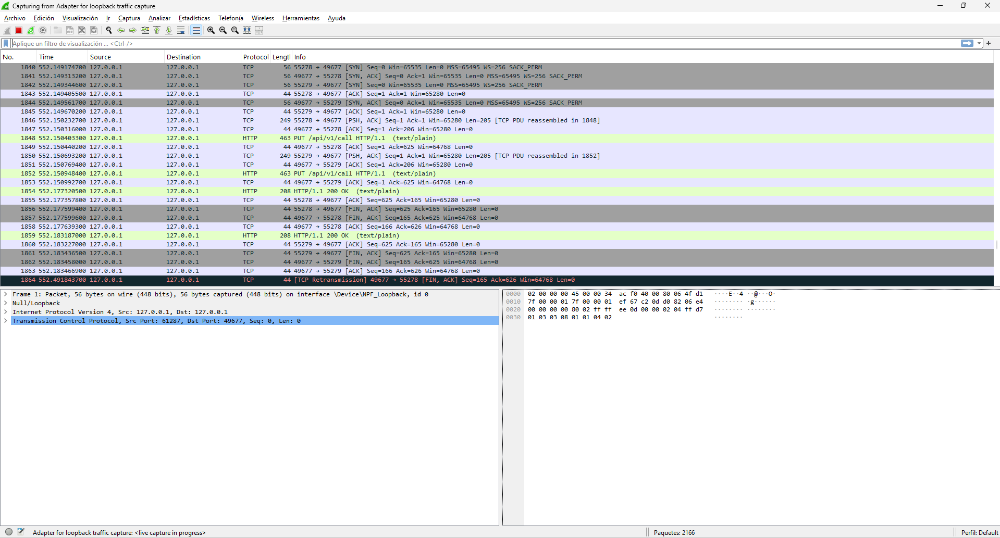

### 8.2 Escenario A: Transmisión en texto plano

Se compilaron y ejecutaron los programas base `Ejemplo1Receptor.java` y `Ejemplo1Emisor.java`. El flujo de la terminal demostró una conexión exitosa y la entrega directa del mensaje confidencial entre los sockets locales:

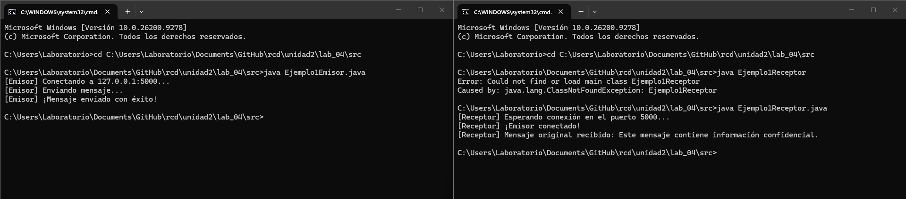

**Análisis del Flujo TCP en Wireshark:**
Al aplicar la reconstrucción del flujo mediante la opción *Seguir → Flujo TCP* (*Follow TCP Stream*), Wireshark interceptó y decodificó de forma inmediata la carga útil del paquete `[PSH, ACK]`. El texto transmitido quedó expuesto sin ninguna barrera de protección, siendo 100% legible:

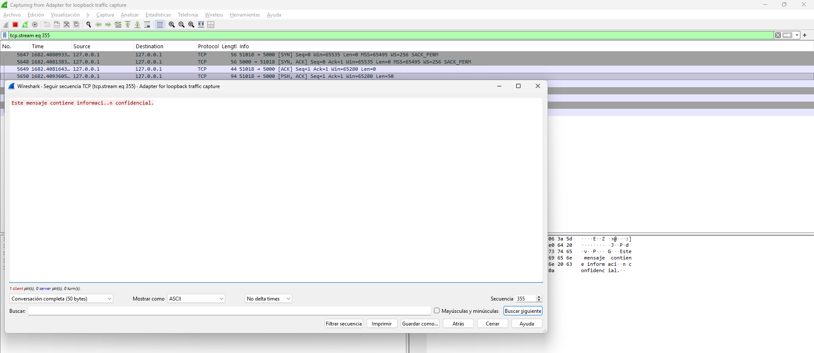

### 8.3 Escenario B: Transmisión protegida con cifrado AES-GCM

Para mitigar la vulnerabilidad de interceptación pasiva, se desarrollaron e implementaron los programas `Ejemplo2Emisor.java` y `Ejemplo2Receptor.java`. Este esquema introduce el algoritmo simétrico **AES** operando en **Modo Galois/Contador (GCM)** con una clave de 128 bits y un vector de inicialización (IV) aleatorio de 12 bytes.

Las terminales de comandos reflejan la transformación matemática de los datos antes de ser inyectados al socket, mostrando la cadena hexadecimal generada y su posterior descifrado exitoso:

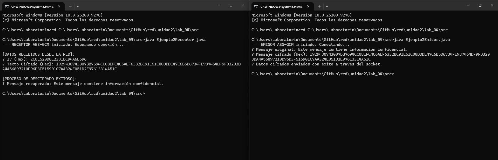

**Análisis del Flujo TCP Cifrado en Wireshark:**
Al inspeccionar el paquete `[PSH, ACK]` de esta segunda transmisión con la herramienta *Seguir → Flujo TCP*, se comprobó que la carga útil se ha transformado por completo en una secuencia pseudoaleatoria de caracteres ilegibles y puntos de control criptográfico, neutralizando el espionaje en la red:

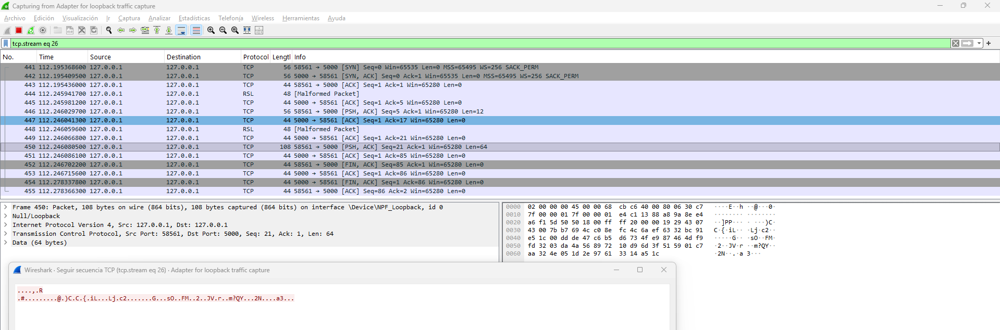

### 8.4 Comparación extendida de algoritmos de protección

| Algoritmo | Tipo de Cifrado | Confidencialidad | Integridad / Autenticación | Mecanismo de control y uso recomendado |
| :--- | :--- | :---: | :---: | :--- |
| **AES/GCM/NoPadding** | Simétrico | Sí | Sí (AEAD) | Genera un Tag de autenticación integrado. Si un bit es modificado en la red, el receptor lanza un error `AEADBadTagException`. |
| **AES/CBC/PKCS5Padding**| Simétrico | Sí | No | Requiere un Vector de Inicialización (IV). Es vulnerable a ataques de alteración de bits si no se añade un MAC independiente. |
| **ChaCha20-Poly1305** | Simétrico | Sí | Sí (AEAD) | Algoritmo de cifrado de flujo de alta velocidad en software. Excelente alternativa a AES para procesadores sin aceleración por hardware. |
| **RSA/OAEP** | Asimétrico | Sí | No | Basado en un par de claves (pública/privada). Alta sobrecarga computacional; diseñado para cifrar claves simétricas, no mensajes largos. |
| **SHA-256** | Hash | No | Sí (Integridad) | Función unidireccional no reversible. No cifra datos, solo genera una huella digital única para verificar que un archivo no cambió. |

### 8.5 Respuestas a las preguntas analíticas de seguridad

- **¿Qué información puede observarse en la red?**
  A nivel de transporte y red, los metadatos permanecen completamente visibles en ambos escenarios: las direcciones IP (`127.0.0.1`), los puertos TCP de origen y destino (`5000`), el tamaño exacto de los segmentos transmitidos y las banderas de control (`SYN`, `ACK`, `PSH`, `FIN`) que gestionan el ciclo de vida de la conexión.
- **¿Qué información deja de ser visible cuando se utiliza cifrado?**
  La carga útil de la aplicación (*payload*). La información confidencial del negocio o del usuario es enmascarada bajo un bloque de entropía criptográfica, impidiendo que un tercero malicioso con acceso al canal físico deduzca el contenido original del mensaje.
- **¿Qué ocurre cuando se intenta modificar un mensaje cifrado en tránsito?**
  Al emplear un modo autenticado (AEAD) como **AES-GCM**, el emisor calcula una etiqueta matemática (Tag) basada en la clave y el contenido. Si un atacante altera un solo bit del mensaje cifrado durante su viaje, el Receptor detectará el cambio al recalcular el Tag localmente. Java interceptará esta brecha de seguridad arrojando una excepción controlada de tipo `javax.crypto.AEADBadTagException`, abortando el procesamiento de los datos corruptos para proteger la integridad del sistema.

### 8.6 Conclusiones del análisis de seguridad

- **Vulnerabilidad de los Sockets Planos:** La transmisión de datos nativa sobre TCP/IP sin capas adicionales es intrínsecamente insegura. Herramientas de diagnóstico comunes como Wireshark demuestran que el sniffing pasivo permite comprometer la confidencialidad de la información de manera inmediata si no se aplican políticas criptográficas.
- **Superioridad de los Modos AEAD:** El uso de cifrado simétrico moderno no debe limitarse a ocultar la información (confidencialidad). Modos avanzados como AES-GCM resuelven el problema de seguridad de forma integral al fusionar el cifrado con la autenticación de mensajes, garantizando que el receptor solo procese paquetes que provengan de un emisor legítimo y que no hayan sufrido modificaciones en el canal de comunicación.
